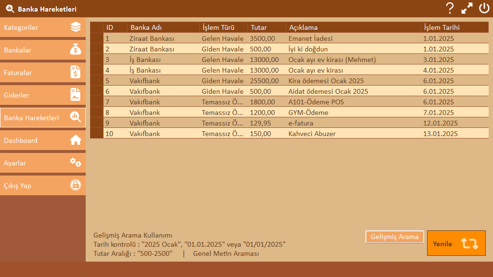

# FinancialCrm

## **Tanım**

Bu projede, **kişisel finans yönetimi** için kapsamlı bir CRM uygulaması geliştirilmiştir.
Uygulama, kullanıcıların finansal durumlarını düzenli olarak takip etmelerini sağlar. 

Kullanıcılar;
- Banka bakiyelerini,
- Faturalarını,
- Harcamalarını ve
- Banka hareketlerini yönetebilir ve analiz edebilir.

---

## **Kullanılan Teknolojiler (Tech Stack)**

**Backend:**

- .NET Framework
- C# programlama dili
- SQL Server
- ADO.NET Entity Data Model
- LINQ Sorguları
- DB First Yaklaşımı

**Frontend:**

- WinForms (Form arayüzü ve bileşenleri)
- FontAwesome.Sharp paketi

### **Hedef Kitle**

- **Kullanıcılar:** Kişisel finans yönetimini kolaylaştırmak isteyen bireyler.
- **Geliştiriciler:** Proje açık kaynak olarak da sunulduğu için katkı sağlayabilecek geliştiriciler.

---

## Başlarken

Proje dosyalarını bilgisayarınıza indiriniz.

Proje SQL Server veri tabanı ile çalışmaktadır. Öncelikle SQL Server ve Management Studio kurulması gerekmektedir.

Ardından  `FinancialCrmDb` içerisinden query veya *.bak dosyası ile veri tabanını kurunuz.  Ayrıntılı bilgi için [./FinancialCrmDb/readme.md](./FinancialCrmDb/readme.md) dosyasını inceleyebilirsiniz.

---

## **Kullanım (Usage)**

Uygulamanın kullanımına dair detaylı bilgiler, [proje dökümanları](./docs/Kullanım) arasında yer almaktadır.

Ana kullanım adımları şunlardır:

1. **Uygulamayı Başlatma**
   `bin\release\` klasöründeki `FinancialCrm.exe` dosyasını çalıştırarak uygulamayı başlatabilirsiniz.
2. **Veritabanı Konfigürasyonu**
   İlk başlatmada gerekli veritabanı ayarlarını yapmanız gerekebilir. Konfigürasyon ekranında gerekli bilgileri girip kaydedebilirsiniz.
3. **Kullanıcı Girişi**
   Veritabanına kullanıcı bilgilerini ekledikten sonra giriş yapabilirsiniz.
4. **Modüller ve Fonksiyonlar**
   Uygulama içinde şu modüller bulunmaktadır:
   - **Dashboard**: Genel bilgiler ve özetler.
   - **Kategoriler**: Giderlerinizi kategorilere ayırma.
   - **Bankalar**: Banka hesaplarınızın ve hareketlerinizin yönetimi.
   - **Faturalar**: Faturalarınızı takip etme.
   - **Giderler**: Harcamalarınızın detaylı yönetimi.
   - **Ayarlar**: Kullanıcı ve veritabanı ayarlarını düzenleme.

Detaylı kullanım rehberi için dökümantasyon dosyasını inceleyebilirsiniz.


---

## Ekran Görüntüleri & GIF'ler





---

## Proje Yapısı

```tex
├── bin/
│   └── release/
│       └── FinancialCrm.exe
├── FinancialCrmDb/
│   ├── FinancialCrm.bak
│   └── readme.md
├── docs/
│   ├── kullanım.md
│   └── usage.md
└── src/
    └── MainApp.csproj
```


---

## Bilinen Sorunlar ve Geliştirme Yol Haritası

* [x] İlk kullanım için kullanıcı bilgileri olmaksızın giriş yapabilme (Login) *
* [x] Kullanıcı bilgilerinin silinmesi veya güncellenmesine yönelik güvenlik önlemi alındı (Doğrulama)
* [x] Fluent Validation eklendi, validasyon işlemleri uygulandı
* [ ] Banka verilerine ilişkin (listeleme, ekleme, silme, güncelleme) işlemleri *
* [ ] Banka hareketleri verilerine ilişkin (listeleme, ekleme, silme, güncelleme) işlemleri *
* [ ] Dashboard ekranında gösterilecek içerikleri arttırma *
  

---

## Katkıda Bulunanlar

Türkçe kaynak ve yazılım sektörüne olan katkılarından dolayı,<br/>aynı zamanda bu projenin geliştirilmesinde önemli bir rol oynayan [@Murat Yücedağ](https://github.com/MuratYucedag) hocamıza teşekkür ederim.

YouTube üzerinde ücretsiz olarak yayımladığı [**C# Proje Kampı**](https://www.youtube.com/playlist?list=PLKnjBHu2xXNPmFMvGKVHA_ijjrgUyNIXr) serisinin ilerleyen bölümlerinde bu projeye başlama fırsatı buldum ve temellerini attım.

---

## Lisans

Bu proje [GNU Affero General Public License v3.0](LICENSE.txt) lisansı altında yayınlanmıştır.
